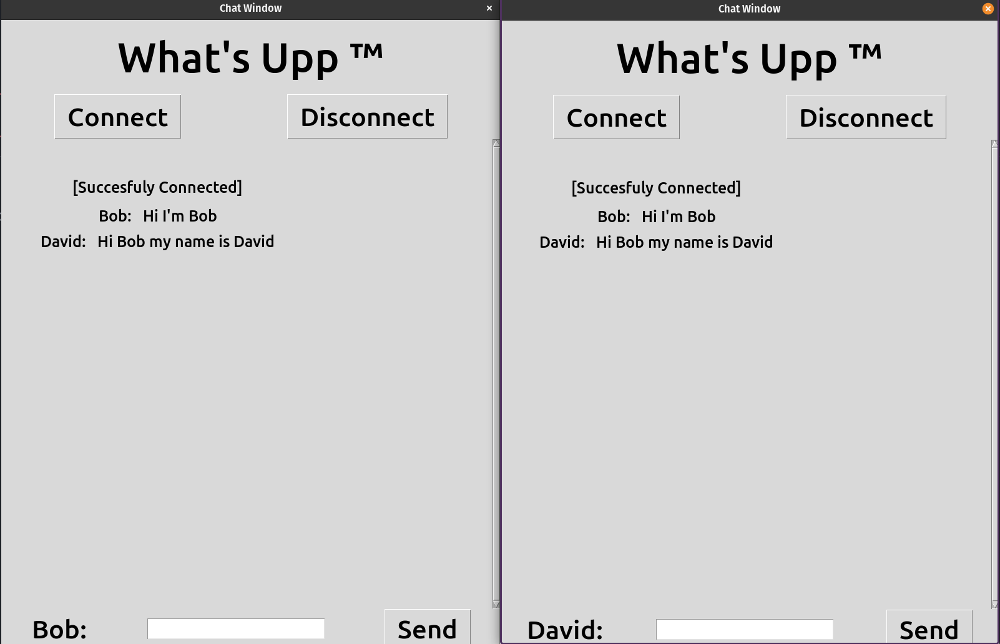
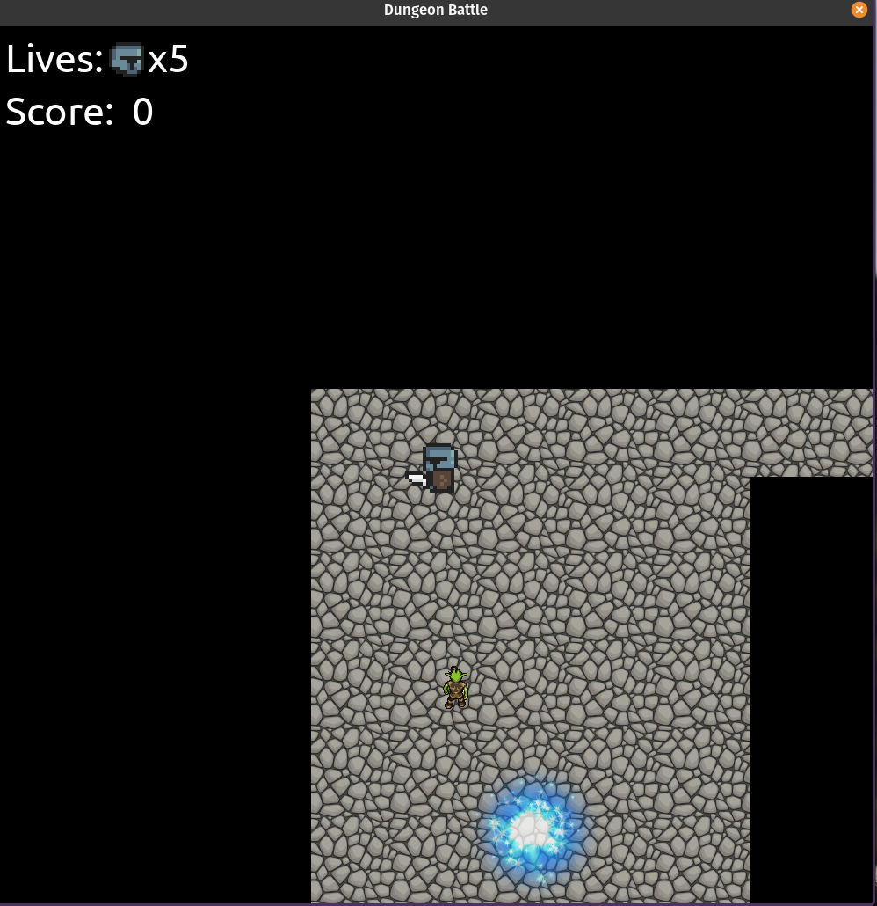
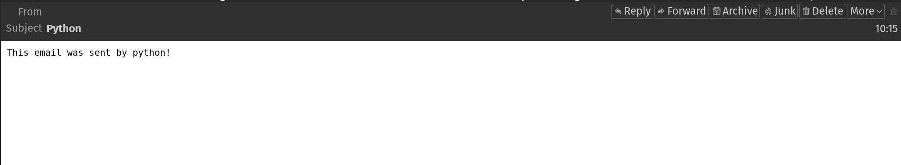
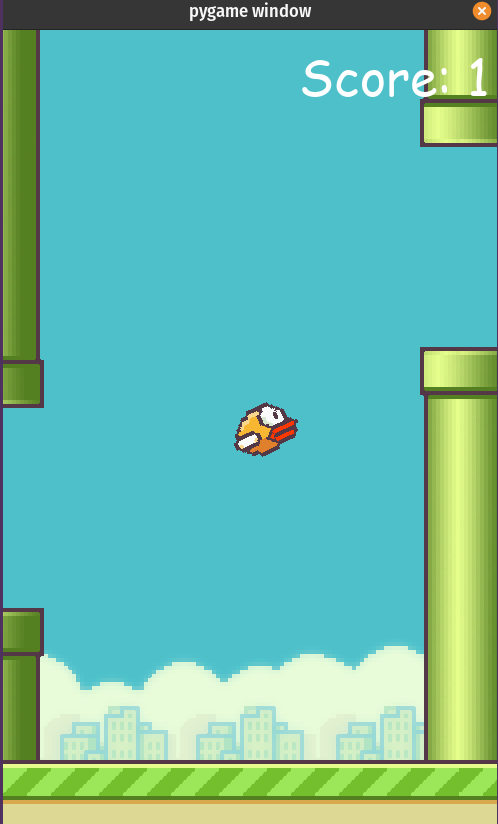
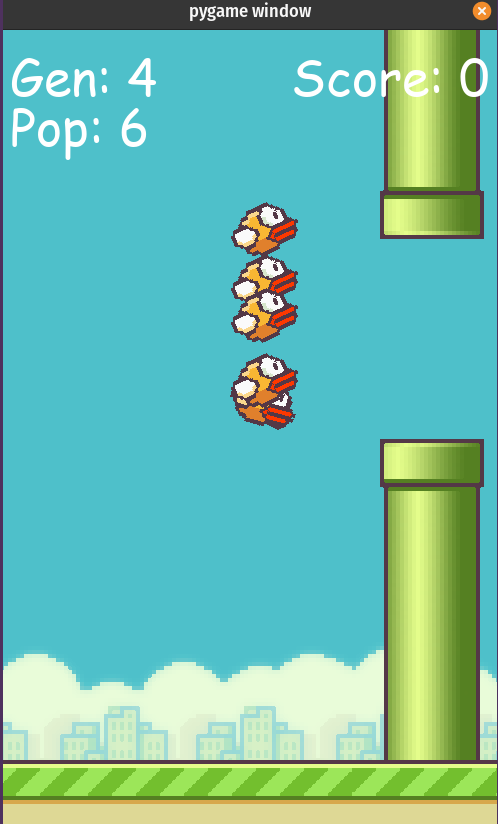
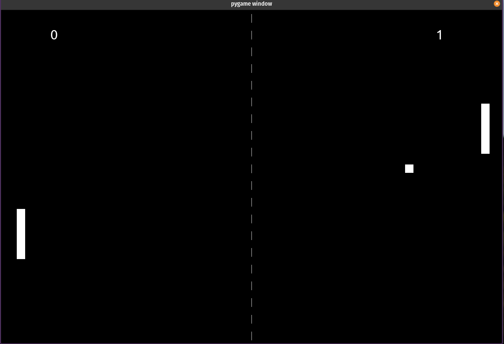
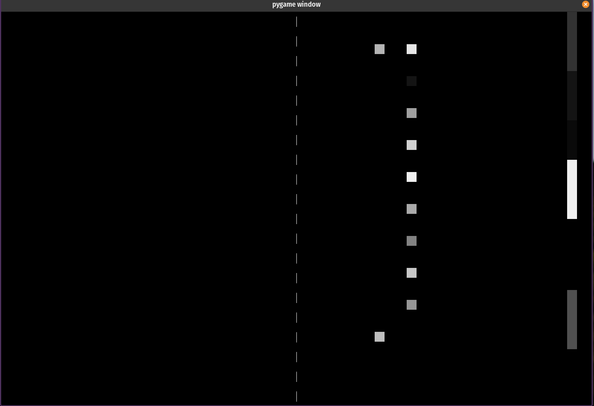
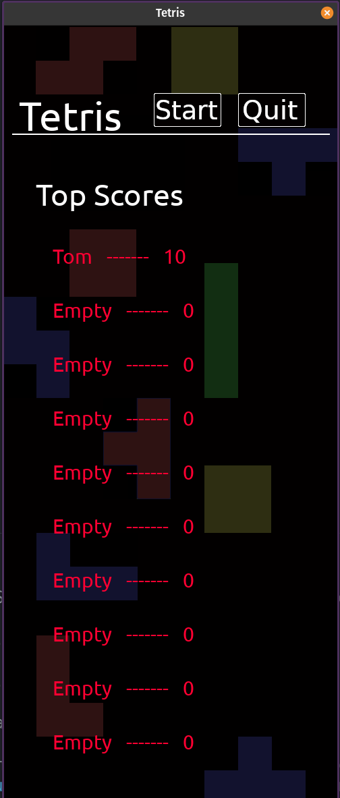
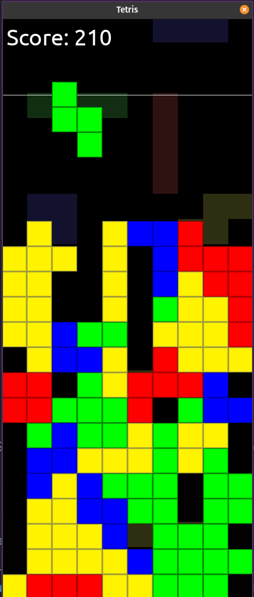
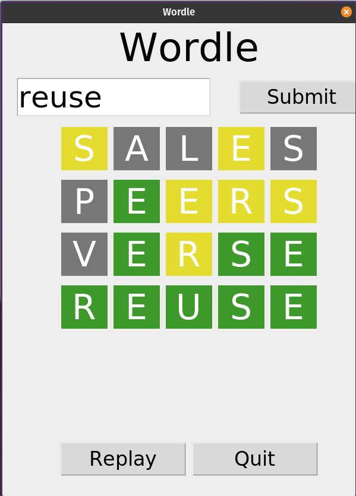

# Gold DofE Skills Section 

For my Gold section I wanted to build of the game development I started looking at towards the end of silver and try a few things that caught my interest. This included: Tetris, Wordle and solver, neural networks and a simple scrolling game.

## Chat Server

This project consists of 2 programs, a server which manages connections and the exchange of information and a client program which sends and recieves data from the server. The socket module and server IP to allow comunication and the threading module to run tasks simultaneously.

First you run the server program, then run the client inputting a username and the IP of the server (0.0.0.0 if its the local machine). Then the chat window will open allowing you to connect, disconnect and send messages.

## Dungeon Scroller

A very common part of games is scrolling, when the character appears stationary realtive to the screen and the world moves around them. I wanted to make a basic game to try this style. My approach was to code the game with reference to the world coordinates and convert them when drawing the images on screen using the screen position in the world. It helped me think of the screen as a window looking into the world.

## Email

I have previously looked at pulling information from websites and APIs, it seemed like a natural progression to send this data somewhere I could access it. This program is a basic case of automating an email using my email adress, which could be combined with other programs to send automated updates about a topic.

## Games and Neural Networks

### Flappy Bird

Flappy bird is another instance of a scrolling game with a simpler setup, so I wanted to take it a step further and hve the bird controlled by an AI. The network is made up of two input nodes for the distances between the bird and the top and bottom of the next gap. Also one output node controlling the bird jump. The program runs multiple generations and refines the model each time based of the highest preforming individual, measured by distance travelled.

## Pong

I choose pong as another simple game that would be interesting to test AI. In this case it uses the 'winning' AI from the training program as the AI for the game you can play, by using the pickle module to save it as a file. Which does mean it's impossible to win!

## Object Detection

Another random project, one program compares to images and determines wether they are the same face. The other uses a conmnected webcam and detects faces in the image and compares them to known faces and labels them if appropriate. The process of comparing images is intensive so the feed is quite slow and only runs recognition every other frame. I'm hoping to come back to this and get a better solution to integrate with other programs!

## Tetris

Having made versions of a few classic games I wanted to try tetris as well. I didn't quite get the mechanics of the game right, I probably should have played it a bit before trying to make it but still very pleased at how it turned out. There is menu and highscore system as well as the gameplay.

## Web Scraping

Another random program, it makes use of wikepedia random articles and attempts to extract the plain text from the page html with partial success depending on the page. This is done using a module called beautiful soup.

## Wordle

For my final program I wanted to make a wordle solver that could fairly reliably beat the wordle puzzle, I also ended up making a wordle game so that I could test its effectivness more easily! The solver outputs it's recommended guess, then asks for your guess and a code for the result. g-Green y-Yellow w-Grey

